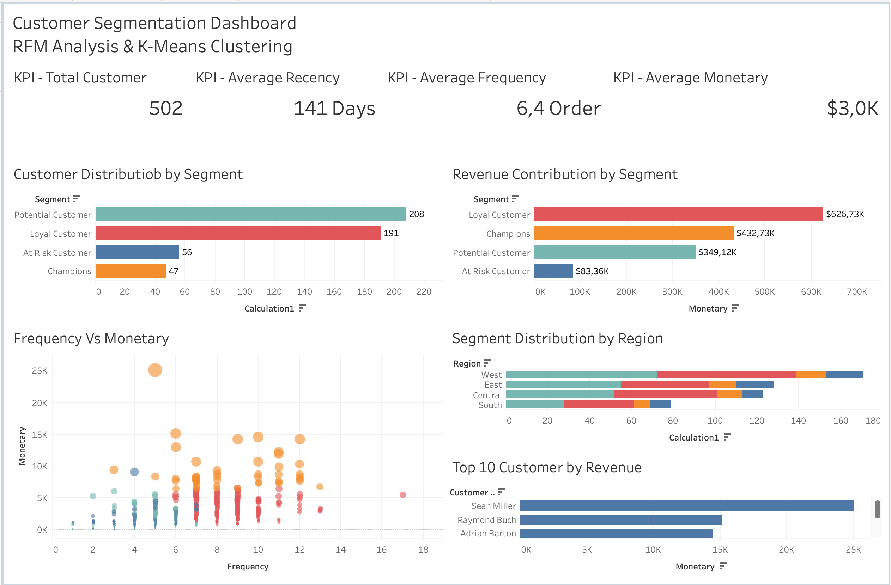

# Customer Segmentation Analysis using RFM & K-Means Clustering

This project analyzes customer purchasing behavior using RFM Analysis and K-Means Clustering. The goal is to segment customers into meaningful groups and provide business recommendations for customer retention and marketing strategy.

## Dashboard Preview

## Project Objectives

- Analyze customer purchasing behavior
- Calculate Recency, Frequency, and Monetary values
- Apply K-Means Clustering for customer segmentation
- Identify high-value and at-risk customer groups
- Provide data-driven marketing recommendations

## Tools & Technologies

- Python
- Pandas
- Scikit-Learn
- Matplotlib
- Seaborn
- Tableau

## Methodology

Dataset  
→ RFM Analysis  
→ Feature Scaling  
→ Elbow Method  
→ K-Means Clustering  
→ Customer Segmentation  
→ Tableau Dashboard  
→ Business Insights

## Customer Segments

| Segment | Description |
|---|---|
| Loyal Customers | Active customers with strong purchase frequency and high revenue contribution |
| Champions | High-value customers with strong purchasing power |
| Potential Customers | Customers with growth potential who can be targeted with promotions |
| At Risk Customers | Inactive or low-value customers who need reactivation campaigns |

## Key Findings

- Loyal Customers generated the highest revenue contribution.
- Champions showed strong monetary value and should be retained with exclusive offers.
- Potential Customers represent an opportunity for upselling and targeted promotions.
- At Risk Customers had the lowest revenue contribution and require reactivation strategies.

## Business Recommendations

- Strengthen retention programs for Loyal Customers.
- Provide exclusive rewards or VIP offers for Champions.
- Target Potential Customers with personalized promotions.
- Create reactivation campaigns for At Risk Customers.
- Use customer segmentation to improve marketing efficiency.

## Tableau Public

[View Interactive Dashboard](insert-your-tableau-public-link-here)

## Author

Albert Alexander  
Computer Science Undergraduate  
Interested in Data Analytics, Data Engineering, and Machine Learning
